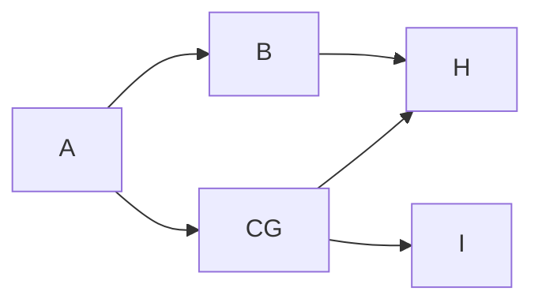

# 7. Relational Database Design

## 7.1 Features of good Relational Design 

    
  

What about combining **instructor and department**?

Pitfalls of the bad” relations “坏”关系的陷阱

* **Information repetition (信息重复)**

* **Insertion anomalies (插入异常)** 

    **`该表的primary key是ID，无法插入单独的一个department（没有老师）`**

* **Update difficulty (更新困难)** 

    如果修改某个系的信息，需要全局修改

数据之间存在着隐含的函数约束关系，**知道了 id 就可以决定其他元素**。 

id $\rightarrow$ name, salary, dept_name; 

dept_name $\rightarrow$ building, budget  

**产生冗余的原因是 dept_name 决定了部分属性，但它却不是这个表的 primary key.**  

> **上面的关系不是BCNF，因为dept_name不是key，只有key能够决定其他的属性**

好的关系：只有 candidate key 能决定其他属性。  

**`无损（没有信息损失）连接（LossLess-join）`**

- 拆表后要有**公共的属性**，否则无法拼接回去
- **公共属性必须是分拆出一个关系模式的primary key**, 。

> **Example "lossy decomposition"** 有损分解例子

 `employee(ID, name, street, city, salary)`

 $\rightarrow$ `employee1 (ID, name)` 

 `employee2 (name, street, city, salary)`

因为此处公共属性name不是primary key

  

观察上图可以发现，**name不是primary key，假设存在重名的现象，那么再重新合并之后无法得到原来的表**

> **Example "Example of Lossless-Join Decomposition "** 
>
> 无损连接例子

  

### 7.1.1 Lossless-join Decomposition

Let $R$ be a relation schema and let $R_1$ and $R_2$ form a decomposition of $R$. That is $R = R_1  \cup R_2$. 

We say that the decomposition is a **lossless decomposition** if there is no loss of information by replacing  R with the two relation schemas $R = R_1  \cup R_2$.  Formally,   $r = \prod_{R_1}(r)  \bowtie \prod_{R_2}(r)$.  

我们说，如果用两个关系模式替换 R 没有信息丢失，则分解是无损分解  $R = R_1  \cup R_2$ 。正式地，$r = \prod_{R_1}(r)  \bowtie \prod_{R_2}(r)$ .

**`如果R1和R2的自然连接恰好是关系R，那么关系R的分解是无损的`**

And,  conversely a decomposition is lossy if $r\subset \prod_{R_1}(r)  \bowtie \prod_{R_2}(r)$   

**Note: *more tuples implies more uncertainty (less information)*.**

**如果R是R1和R2自然连接的子集，那么关系R的分解是有损的。注意：更多的元组意味着更多的不确定性（更少的信息）。**

> **那么我们该如何判断一个分解是不是无损的呢？**
>
> **`A decomposition of R into R1 and R2 is lossless join if at least one of the following dependencies holds: (充分条件)`**

* $R_1\cap R_2\rightarrow R_1$

* $R_1\cap R_2 \rightarrow R_2$  

  **R1和R2的公共属性能够决定R1或者R2，也就是说是其中一个的primary key** 

### 7.1.2 Devise a Theory for the Following

* Decide whether a particular relation R is in “good” form.  

* In the case that a relation R is not in “good” form, decompose it into a set of relations $\{R_1, R_2, \ldots, R_n\}$ such that 
    * each relation is in good form 
    * the decomposition is a lossless-join decomposition   
    
    如果关系 R 不是“好”形式，则将其分解为一组关系 $\{R_1, R_2, \ldots, R_n\}$ ，使得每个关系都处于良好的状态，分解是**无损连接分解（lossless-join decomposition）**
    
* Our theory is based on:
    * functional dependencies 函数依赖
    * multivalued dependencies 多值依赖
    
* Normal  Forms(NF): $1NF \rightarrow 2NF \rightarrow 3NF \rightarrow BCNF \rightarrow 4NF$  

  有些函数依赖，不能在 BCNF 中得到体现，需要把几个表拼在一起才能体现，叫依赖保持。这时我们需要从 BCNF 回到 3NF.  

## 7.2 Functional Dependencies

Functional Dependencies  are *constraints* on the set of legal relations. (来自于应用层面的规定)  

Require that the value for a certain set of attributes determines uniquely the value for another set of attributes.   ***e.g.*** dept_name $\rightarrow$ building  

**`要求某一组属性的值唯一地确定另一组属性的值。例如dept_name → building`**

A functional dependency is a generalization of the notion of a *key*.

函数依赖关系是**键概念**的概括

Let $R$ be a relation schema $\alpha\subseteq R$ and $\beta\subseteq R$ ($\alpha, \beta$ 是属性的集合)

The **functional dependency** $\alpha\rightarrow \beta$ holds on $R$ if and only if for any legal relations $r(R)$, whenever any two tuples $t_1$ and $t_2$ of $r$ agree on the attributes $\alpha$, they also agree on the attributes $\beta$.  That is

**本质上是$\alpha$决定$\beta$**
$$
t_1[\alpha] = t2 [\alpha]   \Rightarrow   t_1[\beta ]  = t_2 [\beta ]
$$

通过数据库实例可以证伪函数依赖，但不能证实。（依赖是来自应用层面的规定，先有函数依赖，再有数据库中的数据）

  

        
  
  
  

上述例子中A：1，B：4，A：1，B：5，说明$A \rightarrow B$不成立，但是能说明$B \rightarrow A$ 可能成立

$A\rightarrow B$ 可以证伪，但也不能因此就说 $B\rightarrow A$

> **利用函数依赖关系定义superkey和candidate key**

* K is a **superkey** for relation schema $R$ if and only if $K\rightarrow R$
* K is a **candidate key** for $R$ if and only if 
    * $K\rightarrow R$, and
    * for no $\alpha\subset K$, $\alpha\rightarrow R$

> **superkey 和 candidate key的区别在于superkey存在冗余**

**`平凡的函数依赖：全集可以决定子集。`**

A functional dependency is **trivial** if it is satisfied by all relations.  

- ID，name $\rightarrow$ ID

- name $\rightarrow$ name  

**In general, $\alpha\rightarrow \beta$ is trivial（平凡的） if $\beta\subseteq \alpha$** 

### 7.2.1 Closure(闭包)

#### 7.2.1.1 Closure of a Set of Functional Dependencies

Given a set $F$ of functional dependencies, there are certain other functional dependencies that are logically implied by $F$.  

The set of all functional dependencies logically implied by $F$ is the **closure** of $F$. We denote the closure of $F$ by $F^+$.  

函数依赖集合F的闭包F+，表示所有能够从函数依赖集合F推导出来的（包括F自身）集合。F+中，也包含一些平凡的函数依赖

***e.g.*** $F=\{A\rightarrow B,B\rightarrow C\}$ then 

$F^+=\{A\rightarrow B, B\rightarrow C, A\rightarrow C, AB\rightarrow B, AB\rightarrow C,\ldots\}$

We can find $F^+$, the closure of $F$, by repeatedly applying ==*Armstrong’s Axioms*==:

* if $\beta\subseteq \alpha$ then $\alpha \rightarrow \beta$ (**reflexivity**, 自反律)
* if $\alpha\rightarrow \beta$ then $\gamma \alpha \rightarrow \gamma \beta$ (**augmentation**, 增补律)
* if $\alpha\rightarrow \beta$ and $\beta \rightarrow \gamma$ then $\alpha\rightarrow \gamma$ (**transitivity**, 传递律)

These rules are 

* **Sound（正确有效的）** generate only functional dependencies that actually hold
* **Complete（完备的）** generate all functional dependencies that hold

      
  

**Additional rules: 附加规则**

* If $\alpha\rightarrow \beta$ holds and $\alpha\rightarrow \gamma$ holds,  then $\alpha\rightarrow \beta\gamma$ holds (**union**, **合并**)
* If $\alpha\rightarrow \beta\gamma$ holds, then $\alpha\rightarrow \beta$ holds and $\alpha\rightarrow \gamma$ holds (**decomposition**, **分解**)
* If $\alpha\rightarrow \beta$ holds and $\gamma \beta\rightarrow \delta$ holds, then $\alpha \gamma\rightarrow \delta$ holds (**pseudotransitivity**，**伪传递**)

 

        
  

 

> **函数依赖，右边的公共属性可以去掉，使得函数双方没有交集。**

#### 7.2.1.2 Closure of Attribute Sets

Given a set of attributes $a$, define the closure of a under $F$ (denoted by $a+$) as **the set of attributes that are functionally determined by $a$ under $F$**  

**`一个属性集合通过函数依赖关系，能够决定的所有属性的集合，称之为属性集合的闭包`**

A->B, B->C, B->D, 可以得到 $A^+ = ABCD$

  

        
  

  

> **一般推荐使用画图法：确定能连到哪个点即可**

$A^+ = ABCH, G^+ = G$,所以AG是一个candidate key，同时也是superkey

#### 7.2.1.3 Uses of Attribute Closure

* Testing for **superkey**:
  To test if $\alpha$ is a superkey, we compute $\alpha+$, and check if $\alpha+$ contains all attributes of $R$.

    **测试超键：为了测试是否 $\alpha$ 是超键，我们计算 $\alpha+$ ，并检查是否 $\alpha+$ 包含 的所有 R 属性。**

* Testing **functional dependencies**
    * To check if a functional dependency $\alpha\rightarrow \beta$ holds (or, in other words, is in $F+$), just check if $\beta\subseteq\alpha+$. 
    
        **要检查功能依赖项 $\alpha\rightarrow \beta$ 是否成立（或者换句话说，在 $F+$ 中 ），只需检查 $\beta\subseteq\alpha+$**
    
    * That is, we compute $\alpha+$ by using attribute closure, and then check if it contains $\beta$. 
    
        也就是说，我们使用属性闭包 $\alpha+$ 进行计算，然后检查它是否包含 $\beta$ 
    
    * Is a simple and cheap test, and very useful
    
* **Computing closure of F**
  For each $\gamma\subseteq R$, we find the closure $\gamma+$, and for each $S \subseteq \gamma+$, we output a functional dependency $\gamma\rightarrow  S$.  

   

        
  

   

## 7.3 Canonical Cover（正则覆盖）

a **canonical cover** of F is a *“minimal”* set of functional dependencies equivalent to F, having no redundant dependencies or redundant parts of dependencies.  

**`正则覆盖也就是化简，不存在冗余的函数依赖,并且任何一条函数依赖不存在多余的属性`**

**减少一条函数依赖**

   

        
  

   

-- Extraneous Attributes(无关属性)

Consider a set $F$ of functional dependencies and the functional dependency $\alpha\rightarrow \beta$ in $F$.  

* Attribute A is **extraneous** in $\alpha$ if $A\in \alpha$ and $F$ logically implies $(F – \{\alpha\rightarrow \beta\})\cup {(\alpha  – A) \rightarrow \beta}$.
* Attribute A is **extraneous** in $\beta$ if $A\in \beta$ and the set of functional dependencies   $(F-\{\alpha \rightarrow \beta\}) \cup \{\alpha \rightarrow (\beta - A) \}$logically implies F. -

A **canonical cover** for $F$ is a set of dependencies Fc such that 

* $F$ logically implies all dependencies in $F_c$

    $F$逻辑蕴含$F_c$中所有的函数属性

* $F_c$ logically implies all dependencies in $F$

    $F_c$逻辑蕴含F中所有的函数属性

* No functional dependency in $F_c$ contains an extraneous attribute

    $F_c$ 的任何函数依赖项都不包含无关属性

* Each left side of functional dependency in $F_c$ is unique.

    **`函数依赖关系的每个 $F_c$ 左侧都是唯一的。`**
  
    对于$A \rightarrow B, A \rightarrow C \Leftrightarrow A \rightarrow BC$

> **Example "Computing a Canonical Cover"**

    
  

    
  

> **利用画图法解决寻找canonical cover**

## 7.4 Boyce-Codd Normal Form

A relation schema $R$ is in **BCNF** with respect to a set $F$ of functional  dependencies if for all functional dependencies in $F^+$ of the form where $\alpha \subseteq R$ and $\beta \subseteq R$, at least one of the following holds  

* $\alpha \rightarrow \beta$ is trivial
* $\alpha$ is a superkey for $R$.  

**任何非平凡的函数依赖的左边都是一个 key.那么它就是BCNF**  

### 7.4.1 Decomposing a Schema into BCNF

对于不是 key 的函数依赖，就把它分解出来作为**单独的关系模式**。  

Suppose we have a schema $R$ and a non-trivial dependency $\alpha\rightarrow \beta$ causes a violation of BCNF. We decompose $R$ into:

$(\alpha \cup \beta)$ and $(R-(\beta-\alpha))$  

> **$\alpha$ 作为两个关系模式的公共属性，也是一个关系的 key, 这样才是无损分解。**

  
  
  

$F = \{A->B, B->CD\}$ 上述并不是BCNF，因为存在一条非平凡的函数依赖$B \rightarrow CD$,其中B不是candidate key

**`但是我们可以将其分成两个关系R1，R2，分别得到两个非平凡的函数依赖，每一函数依赖的左边都是对应关系的candidate key`**

**同时是无损连接分解，因为共有属性B决定CD**

###  7.4.2 Dependency Preservation

**依赖保持：原来的函数依赖，都可以在分解后的函数依赖中得到单独检验。**

Constraints, including functional dependencies, are costly to check in practice unless they pertain to only one relation.  

If it is sufficient to test only those dependencies on each individual relation of a decomposition in order to ensure that all functional dependencies hold, then that decomposition is **dependency preserving (保持依赖)**.

- （如果通过检验单一关系上的函数依赖，就能确保所有的函数依赖成立，那么这样的分解是依赖保持的）
- （或者，**`原来关系R上的每一个函数依赖，都可以在分解后的单一关系上得到检验或者推导得到`**）

**`多个关系联合推导得到函数依赖，也算是依赖保持`**

Let $F_i$ be the set of all functional dependencies in $F^+$ that include only attributes in $R_i$. ($F_i$:  the restriction of $F$ on $R_i$)

* **A decomposition is dependency preserving, if $(F_1\cup F_2 \cup \ldots \cup F_n )^+ = F^+$**
* If it is not, then checking updates for violation of functional dependencies may require computing joins, which is expensive.

  

        
  

  

原来关系R上的每一个函数依赖，不能在分解后的单一关系上得到检验或者推导得到。

**同时将两个关系联合依然无法推出 B->C**,所以不满足依赖保持性

1. 方法一：先分解E->D

  

        
  

  

B->D 无法从上面的函数依赖中推导出来

方法二：先分解B->CD

> **上述的分解方法：能够保证BCNF，但是不能保证dependency perservation**

此处(J,K,L),先利用$L\rightarrow K$,划分出关系R(L,K),此时原先的只剩(J,L),显然从（J，L）无法推导出$JK \rightarrow L$,所以依赖不保持

Because it is not always possible to achieve both BCNF and dependency preservation, we consider a weaker normal form, known as **third normal form**.

**由于很难同时达到BCNF并且依赖保持，所以我引入一个弱一点的范式，Third normal form**

### 7.4.3 Third Normal Form

**`任何一个非平凡函数依赖，如果左边不是一个 super key, 那么右边必须包含在一个 candidate key 里面`**。

A relation schema $R$ is in third normal form (3NF) if for all: $\alpha\rightarrow \beta $ in $F^+$ at least one of the following holds:

* $\alpha\rightarrow \beta$ is trivial (i.e., $\beta \in \alpha$)

* $\alpha$ is a superkey for R

* Each attribute A in $\beta-\alpha$ is contained in a candidate key for $R$.  

  candidate key有很多个，包含在某一个candidate key即可。  

  

  L-> K, 由于L不是key，所以不是BCNF

  **但是K 是 JK的一部分，所以L->K是 Third Normal Form**
  
     

          
  

     

  
  

三范式的分解

> **BCNF 和 3NF 的区别**
>
> 1. **将relation 分解为 3NF，能够保持依赖，并且是无损连接分解**
> 2. **将relation 分解为BCNF，有时无法同时保证无损连接分解和依赖保持**

### 7.4.4 Goals of Normalization

In the case that a relation scheme R is not in “good” form, decompose it into a set of relation scheme  $\{R_1, R_2, \ldots, R_n\}$ such that 

* each relation scheme is in good form (**i.e.**, BCNF or 3NF)
* the decomposition is a lossless-join decomposition
* Preferably, the decomposition should be dependency preserving

**`要么BCNF，要么3NF，无损连接分解，依赖保持`**

Example "E-R Modeling and Normal Forms"
   

        
  

    
  

   

1. 先指出非平凡的函数关系in S

    many to many，将主键合并得到新的主键，共同决定G

2. S中存在的问题，类比之前的department和instructor

    存在

      * **Information repetition (信息重复)**

      * **Insertion anomalies (插入异常)** 

        **`该表的primary key是ID，无法插入单独的一个department`**

      * **Update difficulty (更新困难)** 

3. R2，R3的公共属性D决定R2，R1和($R2 \bowtie R3$)的公共属性A决定R1

这里的无损分解，先指定一个路径，考虑每两个关系直接是否无损（公共属性是否为其中一个关系的 key）。

##  7.5 Multivalued Dependencies

There are database schemas in BCNF that do not seem to be sufficiently normalized.  

第一张table包含着平凡的函数依赖，所以也是BCNF。但是存在着信息冗余，插入异常，更新困难的问题

第二张table虽然是平凡的函数依赖，是BCNF，但是问题消失

存在两种不相关的多值依赖。老师 id 可以多值决定 child_name, 又可以多值决定 phone, 但这两个属性是不相关的，放在一个表里就会组合。  

第二张图的为 **Fourth Normal Form (4NF)**.

> **`四范式：不存在非平凡的多值依赖。`**

Let R be a relation schema and let $\alpha\subset R$ and $\beta\subset R$. The **multivalued dependency** $\alpha\rightarrow\rightarrow\beta$ holds on $R$ if in any legal relation $r(R)$, for all pairs for tuples $t_1$ and $t_2$ in $r$ such that $t_1[\alpha] = t_2 [\alpha]$, there exist tuples $t_3$ and $t_4$ in $r$ such that: 

$$
t_3[\alpha] = t_4[\alpha] = t_1[\alpha]=t_2[\alpha]\\
t_3[\beta]=t_1[\beta]\\
t_3[R-\beta]=t_2[R-\beta]\\
t_4[\beta]=t_2[\beta]\\
t_4[R-\beta]=t_1[R-\beta]
$$

A relation schema $R$ is in **4NF** with respect to a set $D$ of functional and multivalued dependencies if for all multivalued dependencies in $D^+$ of the form $\alpha\rightarrow \rightarrow \beta$, where $\alpha\subset R$ and $\beta\subset R$, at least one of the following hold:

* $\alpha\rightarrow \rightarrow \beta$ is trivial (i.e., $\beta \subset \alpha$ or $\alpha \cup \beta= R$)    
即除了 $\alpha,\beta$ 为没有其他属性。
* $\alpha$ is a superkey for schema $R$

任何一个多值依赖，要么左边就是个 key, 要么这个依赖是平凡的。

??? Example "E-R Modeling and Normal Forms"

    
  

  

**最后的分解满足之前ER图的分解，多值需要单独创建一个关系**

不是 BCNF, 因此也不是 4NF. 

## 7.6 Overall Database Design Process

Denormalization for Performance

Some aspects of database design are not caught by normalization.  

有时候我们需要引入冗余，来保持性能。

在course和prereq中都包含course_id, course_name,查询的时候能够方便很多（虽然有信息冗余）

        
  

